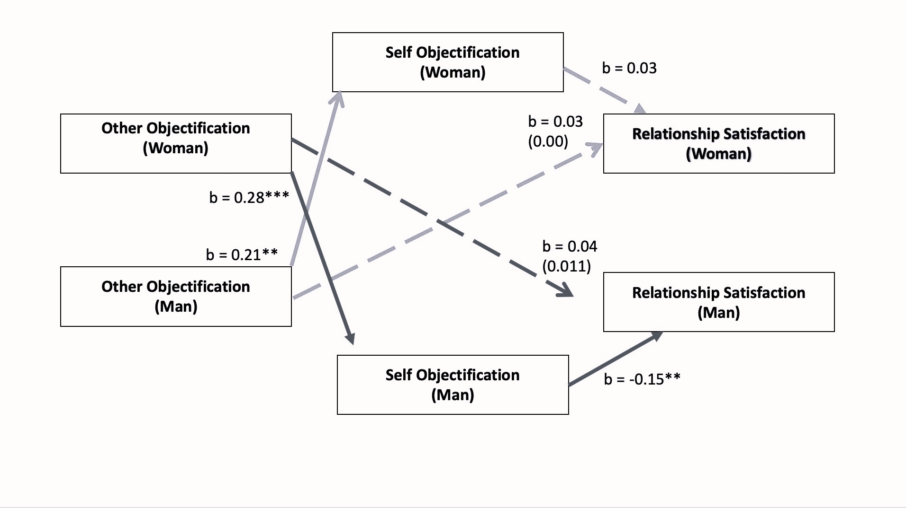

```{r setup, include = FALSE}
library("papaja")
r_refs("r-references.bib")
```

```{r analysis-preferences}
# Seed for random number generation
set.seed(42)
knitr::opts_chunk$set(cache.extra = knitr::rand_seed)
```

```{r, include= FALSE}
# Loading in the dataset
library(tidyverse)
library(nlme)

pairwise <- read.csv("pairwise2.csv")
```

```{r, include = FALSE}
pairwise <- pairwise %>%
  rename(self_object_A = self_object.tavg_A, 
         other_object_A = other_object.tavg_A,
         relation_sat_A = relation_qual.avg_A,
         self_object_P = self_object.tavg_P,
         other_object_P = other_object.tavg_P,
         relation_sat_P = relation_qual.avg_P) %>%
  mutate(gender_AF = ifelse(gender_A == 1, "man", "woman")) %>%
  select(Dyad_ID, partnum, gender_A, gender_AF, self_object_A, other_object_A, relation_sat_A, self_object_P, other_object_P, relation_sat_P)
```

# Results

## Analysis Strategy

Our study aims to provide insight into how men and women in relationships objectify themselves and their partner differently, and how this explains their own and their partner's satisfaction in their relationship. We hypothesized that high levels of being objectified by one's partner will be associated with lower levels of relationship satisfaction for both men and women; there will be a stronger association between being objectified and relationship satisfaction for women than for men in heterosexual relationships; the association between a man's objectification of his partner and his partner's relationship satisfaction will be mediated by the woman's objectification of herself; the association between a woman's objectification of her partner and her partner's relationship satisfaction will be mediated by the man's objectification of himself.

## Main Results

### Relationship Satisfaction and Partner Objectifcation

Figure 1 shows the direct association between predictors (his objectification of her and her objectification of him, and relationship satisfaction for both the man and the woman. Figure 1 shows there were no significant associations between a man's objectification of his partner with the woman's relationship satisfaction (<em>b</em> = 0.011, <em>SE</em> = .057, <em>p</em> = 0.846), nor between the woman's objectification of her partner with the man's relationship satisfaction (<em>b</em> = 0.002, <em>SE</em> = .060, <em>p</em> = 0.967) (see Figure 1). Hypothesis 1 was not supported as the results show there was not a statistically significant relationship between other objectification and relationship satisfaction for both men and women. Hypothesis 2 was not supported as the results show there are not statistically significant differences in the relationship between other objectification and relationship satisfaction between genders. Please refer to Figure 2 for more information about ..........

The Moderated Mediation Model: This figure shows the associations between predictors, mediators, and response variables as moderated by gender. Mediation model 1 is represented by light grey arrows, and mediation model 2 is represented by dark grey arrows. Dashed arrows are not statistically significant coefficients (b) with associated p-values \> 0.05. Bold arrows and asterix are statistically significant coefficients (b) with associated p-values \< 0.05.

### Relationship Satisfaction with Mediation

Mediation models 1 and 2 include the variable self objectification for both the man and the woman as a mediator of the relationship between a man's other objectification of his partner and the woman's relationship satisfaction (model 1), and the associations between a woman's other objectification of her partner and the man's relationship satisfaction (model 2).

In Mediation model 1, there was no significant association between the man's partner objectification towards the woman with the woman's relationship satisfaction while controlling for the woman's objectification of herself (<em>b</em> = 0.03, <em>SE</em> = .064, <em>p</em> = 0.687)(see Figure 1). This does not support our third hypothesis which suggested that the association between man's objectification of his partner and the partner's relationship satisfaction is dependent on a woman's objectification of herself. However, model 1 did result in a statistically significant association between the man's partner objectification and the woman's self objectification (<em>b</em> = 0.279, <em>p</em> < 0.001)(see Figure 1.). This suggests that a man who objectifies the woman in a heterosexual relationship is associated with the woman objectifying herself more.

Model 2 shows that there is no significant association between a woman's objectification of her partner and the partner's relationship satisfaction with the man's self objectification as a mediating variable (<em>b</em> = 0.026, <em>p</em> = 0.687)( see Figure 1.). This does not support our fourth hypothesis that the association between a woman's objectification of her partner and the partner's relationship satisfaction is dependent on a man's objectification of himself. However, Model 2 also shows that there is a statistically significant indirect relationship between the woman's partner objectification and the man's self objectification (<em>b</em> = 0.209, <em>p</em> = 0.011). This suggests that a woman's partner objectification towards the man makes men in heterosexual relationships objectify themselves more. Results in model 2 also show that a man's objectification of himself is associated with a decrease in his relationship satisfaction (<em>b</em> = -0.150, <em>p</em> = 0.015)(see Figure 1.).




